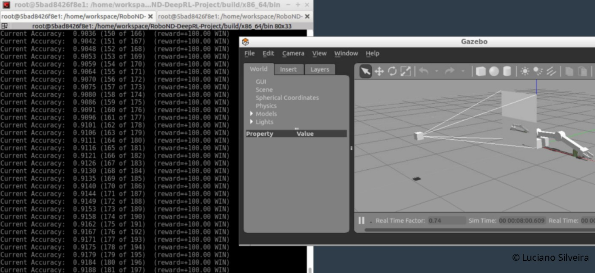

# RoboND-DeepRL-Project
Robotic Deep Reinceforment Learning Project

## Abstract

The objective of the project is to create an artificially intelligent agent that learns from interacting with their environment, gathering experience, and a system of rewards with deep reinforcement learning (deep RL). By means of end-to-end neural networks that translate raw pixels into actions, RL-trained agents are capable of exhibiting intuitive behaviors and performing complex tasks. The larger goal is to develop general-purpose AI systems that can interact and learn from the world as humans do.

## Introduction

In the last few year the usage of Deep Learning in Robotics has exponencially grow because of the potencial it has in solving complex problems.

To train reinforcement learning agents from virtual robotic simulation in 3D and transfer the agent to a real-world robot has the potencial to drastically change the Robotics landscape. In that sense, reinforcement learners choose the best action for the agent to perform based on environmental state (like camera inputs) and rewards that provide feedback to the agent about it's performance. Reinforcement learning can learn to behave optimally in it's environment given a policy, or task - like obtaining the reward.

This project explores the usage of a discrete Deep Q-Learning (DQN) agent to teach a robotic arm with two tasks.

## Background

Reinforcement learning is learning what to do-how to map situations to actions-so as to maximize a numerical reward signal. In that sense the agent is not told which actions to take, but instead must discover which actions yield the most reward by trying them; they need to adapt, react, and self-supervise themselves.

The term `trial and error` search and `delayed reward` are the two most important distinguishing features of reinforcement learning.

Reinforcement learning can be understood using the concepts of agents, environments, states, actions and rewards.


 * An `agent` takes actions. The algorithm is the agent. In life, the agent is you.
 * `Action` is the set of all possible moves the agent can make.
 * The `discount factor` is multiplied by future rewards as discovered by the agent in order to dampen these rewards effect on the agents choice of action; to make future rewards worth less than immediate ones.
 * The `environment` (the world through which the agent moves) takes the agent's current state and action as input, and returns as output the agent's reward and its next state.
 * A `state` is a concrete and immediate situation in which the agent finds itself; an instantaneous configuration that puts the agent in relation to other significant things such as tools, obstacles, enemies or prizes.
 * A `reward` is the feedback by which we measure the success or failure of an agent's actions.

Reinforcement learning represents an agent's attempt to approximate the environment's function, such that we can send actions into the black-box environment that maximize the rewards it returns.

Where do neural networks fit in? Neural networks are the agent that learns to map state-action pairs to rewards. Like all neural networks, they use coefficients to approximate the function relating inputs to outputs, and their learning consists to finding the right coefficients, or weights, by iteratively adjusting those weights along gradients that promise less error.

In many scenarios, the state space is significantly complex and multi-dimensional to where neural networks are increasingly used to predict the best action, which is where deep reinforcement learning and GPU acceleration comes into play. With deep reinforcement learning, the agents are typically processing 2D imagery using convolutional neural networks (CNNs), processing inputs that are an order of magnitude more complex than low-dimensional RL, and have the ability to learn "from vision" with the end-to-end network (referred to as "pixels-to-actions").

This project was entirely resolved using Udacity's workspace and the pytorch framework with [openAI gym environment](https://blog.openai.com/openai-gym-beta/) to verify that the deep reinforcement learning algorithms are indeed learning.

[OpenAI Gym](http://gym.openai.com/) is a is a toolkit for reinforcement learning research that has recently gained popularity in the machine learning community. OpenAI Gym focuses on the episodic setting of RL, aiming to maximize the expectation of total reward each episode and to get an acceptable level of performance as fast as possible.

The main problem with Reinceforment Learning in robotics is the high cost per trial, which is not only the economical cost but also the long time needed to perform learning operations. Another known issue is that learning with a real robot in a real environment can be dangerous, specially with flying robots like quad-copters. In order to overcome this difficulties, advanced robotics simulators like [Gazebo](http://gazebosim.org/) have been developed which help saving costs, reducing time and speeding up the simulation.

The architecture consists of three main software blocks: OpenAI Gym, ROS and Gazebo. Environments developed in OpenAI Gym interact with the Robot Operating System, which is the connection between the Gym itself and Gazebo simulator. Gazebo provides a robust physics engine, high-quality graphics, and convenient programmatic and graphical interfaces.

The [gazebo-arm.world](gazebo/gazebo-arm.world) include three main components which define the environment:

 * The robotic arm with a gripper attached to it.
 * A camera sensor, to capture images to feed into the DQN.
 * A cylindrical object.

The objective is to teach a robotic arm to carry out two primary objectives:

 * Have any part of the robot arm touch the object of interest, with at least a 90% accuracy.
 * Have only the gripper base of the robot arm touch the object, with at least a 80% accuracy.

A DQN agent and reward functions were created to solve the case.

### Agent Behavior

For this case the Agent is a `dqnAgent` which is instanciated on the simulation. The DQN agent is discrete so the network selects one output for every frame. This output (action value) can then be mapped to a specific action - controlling the arm joints. The `updateAgent()` method, receives the action value from the DQN, and decides to take that action. There are two possible ways to control the arm joints:

 * Velocity Control
 * Position Control

For both of these types of control, it is possible to increase or decrease either the joint velocity or the joint position, by a small delta value.

The user provides their sensor data (in this case data from a camera) and environmental state, to the `NextAction()` function, which calls the Python script and returns the predicted action, which the user then applies to robot on the Gazebo simulation.

Next the reward is issued in the `NextReward()` function, which provides feedback to the learner from the environment and kicks off the next training iteration that makes the agent learn over time.

In the code, the `ArmPlugin::OnUpdate()` method is executed to issue rewards and train the DQN. It is called upon at every simulation iteration and can be used to update the robot joints, issue end of episode (EOE) rewards, or issue interim rewards based on the desired goal. At EOE, various parameters for the API and the plugin are reset, and the current accuracy of the agent performing the appropriate task is displayed on the terminal.

### LSTMs

The LSTM architecture is a special type of neural network which utilize memory (the previous state), to predict the current output; it keeps track of the long-term memory and the short-term memory, where the short-term memory is the output or the prediction.


For the project, every camera frame, at every simulation iteration, is fed into the DQN and the agent then makes a prediction and carries out an appropriate action. Using LSTMs as part of that network, the training takes into consideration multiple past frames from the camera sensor instead of a single frame.

The network in [DQN.py](python/DQN.py) has been defined such that it is possible to include LSTMs into the network easily.

#### Parameters

Initially `RMSprop` optimized was tested but then changed to `Adam`; as it can be viewed as a combination of `RMSprop` and `momentum`. `RMSprop` contributes the exponentially decaying average of past squared gradients, while `momentum` accounts for the exponentially decaying average of past gradients.

The environment width and height (`INPUT_WIDTH` and `INPUT_HEIGHT`) was set to 64x64 based on a 3 image channels (`INPUT_CHANNEL`). The learning rate (`LEARNING_RATE`) values tested were 0.01f and 0.1f with a 5k to 20k replay memory (`REPLAY_MEMORY`).

The selected batch size used is 64, the experimentation was done with 64, 128, 256, 512.

The `USE_LSTM` parameter was enabled using a 256 `LSTM_SIZE` value.

The following parameters were not changed:

```
#define GAMMA 0.9f                  // discount factor
#define EPS_START 0.9f              // starting greedy value
#define EPS_END 0.05f               // ending greedy value
#define EPS_DECAY 200               // greedy decay rate
#define ALLOW_RANDOM true           // Allow RL agent to make random choices
#define DEBUG_DQN false             // Turn on or off DQN debug mode
```

## Results

Once the simulation is started the following is displayed:


For the first objective; the robot needs to touch any part of the object of interest with at least a 90% accuracy. The LEARNING_RATE was 0.1 with REPLAY_MEMORY at 1000.



For objective 2 where only the gripper base needs to touch the object of interest with at least a 80% accuracy. The LEARNING_RATE was decreased to 0.01 due to the higher REPLAY_MEMORY set at 20000. The higher REPLAY_MEMORY was used so as to allow for more discrete learning, due to the smaller surface area required to achieve a collision to meet objectives.


The `EPS_Start` and `EPS_end` parameters are the start and end values of the exploration parameter; the probability that the arm will simply take a random action rather than the action chosen by the model in order to encourage it to `explore` the state space. This values decreases after each learning episode to a minimum value of `EPS_END`. These values were not changed; on the slack channel it was detailed that you can get more stability out of the arm in later iterations if you reduce `EPS_END`.

When the reward function is appropriate, a smaller `EPS_DECAY` value can be used; the robot arm will learn more quickly.

### Directions

## Discussion

The initial parameter configuration was taken using the original [Nvidia ArmPlugin](https://github.com/dusty-nv/jetson-reinforcement/blob/master/gazebo/ArmPlugin.cpp) configuration.

Based on that it created the initial working environment to iterate and fine tune parameters as previously detailed.

The initial rewards are set as follows:

```
#define REWARD_WIN  250.0f
#define REWARD_LOSS -250.0f
#define REWARD_MULTIPLIER 150.0f
```

Then the reward is smoothed taking into accoutn the delta of the distance to the goal using Udacity's suggestion:

```
avgGoalDelta = (avgGoalDelta * movingAvg) + (distDelta * (1.0f - movingAvg));
rewardHistory = avgGoalDelta * REWARD_MULTIPLIER; // exp(-GAMMA_FALLOFF * distGoal) * 0.1f;
newReward = true;
```

When defining the contact between the gripper and the ground, the `bool checkGroundContact` variables is calculated as `(gripBBox.min.z <= groundContact)` or `(gripBBox.max.z <= groundContact)`.

If the gripper hits the ground plus the threshold, the episode should end since it could be dangerous or could damage the robot; the `endEpisode` variable is always set to `true`.

To check the collision between the arm and object, the following comparison is done:

```
(strcmp(contacts->contact(i).collision1().c_str(),COLLISION_ITEM) ==0) &&
(strcmp(contacts->contact(i).collision2().c_str(),COLLISION_POINT)==0)
```

For the project, the default `position joint control` was used, there was no experimentation using `velocity control`.

### Troubleshooting

The following error appears when trying to compile the project:

```
from /home/workspace/RoboND-DeepRL-Project/gazebo/gazebo-pkgs/gazebo_grasp_plugin/src/GazeboGraspFix.cpp:2:
/usr/local/include/ignition/math/MassMatrix3.hh:477:19: error: 'IGN_MASSMATRIX3_DEFAULT_TOLERANCE' was not declared in this scope
                   IGN_MASSMATRIX3_DEFAULT_TOLERANCE<T>) const
                   ^
```

The [solution](https://udacity-robotics.slack.com/archives/CAH20A98W/p1532966091000397?thread_ts=1532656290.000108&cid=CAH20A98W) was to install the following:

```sh
sudo apt-get install libignition-math2-dev
```

While executing the `gazebo-arm.sh` script the following error occurs:

```
[Err] [RenderEngine.cc:749] Unable to create glx visual
```

The [solution](https://udacity-robotics.slack.com/archives/CAH20A98W/p1526187953000034?thread_ts=1525227352.000087&cid=CAH20A98W) was to run the command `./gazebo-arm.sh` *within* the desktop and not in workspace (which wasn't clear).

The following errors appeared when running the provided environment without GPU support.

```
make[2]: *** No rule to make target '/opt/conda/lib/libcudart.so', needed by 'x86_64/lib/libjetson-utils.so'.  Stop.
```

The following error appears when building the environment using the [initial repository](https://github.com/udacity/RoboND-DeepRL-Project).

```
fatal error: THC/THC.h: No such file or directory
```

The solution was to compare the complete project with the one on the VM and apply the differences, the following [commit](https://github.com/ladrians/RoboND-DeepRL-Project-P8/commit/58eb009e0dbe98c3ed11f3bf1aba2ce2cadfa191) solves the issue.

When launching the desktop environment the following error message appears; it doesn't seem to cause any trouble for the simulation:

```
[Error]
No session for pid <number>
[Ok]
```

## Conclusion / Future Work

Deep Reinforcement Learning is a new field and an active area of research. It promises to provide an end-to-end, `pixels to actions` solution for many robotics problems. The deeper understanding of surroundings that can be achieved with RL agents: an agent can perform experiments to better `understand` its complex and changing environment, which leads to more nuanced and human-like behavior by the robot. Agents using deep reinforcement learning (deep RL) methods have shown tremendous success in learning complex behaviour skills and solving challenging control tasks in high-dimensional raw sensory state-space.

There are other alternaves to DQN such as the [Sarsa algorithm](https://www.cse.unsw.edu.au/~cs9417ml/RL1/algorithms.html) (state-action-reward-state-action). The major difference between Sarsa and Q-Learning, is that the maximum reward for the next state is not necessarily used for updating the Q-values (learning table). Instead, a new action, and therefore reward, is selected using the same policy that determined the original action. This is how Sarsa is able to take into account the control policy of the agent during learning. It means that information needs to be stored longer before the action values can be updated, but also means that our robot is going to take risky actions much frequently.

Another possibility is to experiment with the [Asynchronous Advantage Actor-Critic(A3C) algorithm](https://medium.com/emergent-future/simple-reinforcement-learning-with-tensorflow-part-8-asynchronous-actor-critic-agents-a3c-c88f72a5e9f2). This algorithm eclipses DQN because it is faster and more robust. It builds on actor-critic with the innovations of multiple `asynchronous` workers as well as an `advantage` feature.

Finally, training a robot through trial and error in simulation cannot fully prepare it for a real world environment. While training in a simulator costs time and compute power, it doesn't involve the physical risk that occurs from failures with a real world mobile robot. Advances in photo-realistic generation of realistic simulation environments may hold promise in this area.

### Links:
 * `jetson-reinforcement` developed by [Dustin Franklin](https://github.com/dusty-nv).
 * [Initial Repository](https://github.com/udacity/RoboND-DeepRL-Project)
 * [watermark](https://www.watermarquee.com/watermark)
 * [This repository](https://github.com/ladrians/RoboND-DeepRL-Project-P8)
 * [Project Rubric](https://review.udacity.com/#!/rubrics/1439/view)
 * [A Beginner's Guide to Deep Reinforcement Learning](https://skymind.ai/wiki/deep-reinforcement-learning)
 * [Deep Learning in a Nutshell: Reinforcement Learning](https://devblogs.nvidia.com/deep-learning-nutshell-reinforcement-learning/)
 * [Gazebo](http://gazebosim.org/)
 * [pytorch validation](https://github.com/dusty-nv/jetson-reinforcement#verifying-pytorch)
